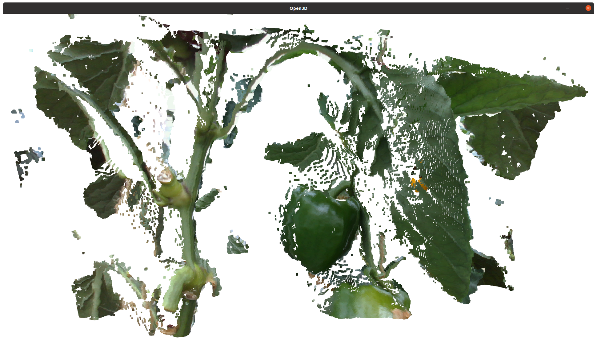

# depth_to_pointcloud_python

I couldn't find an alternative implementation of ROS `image_pipeline` depth to pointcloud conversion for pinhole camera model in Python. So, this implementation does the same thing as the `convert` function implemented [here](https://github.com/ros-perception/image_pipeline/blob/noetic/depth_image_proc/include/depth_image_proc/depth_conversions.h). Just copy the function in `depth_to_pointcloud.py` and use it. Features:

- 16 bit unsigned integer depth input.
- 16/32/64 bit floating point depth input.
- Uses only numpy.